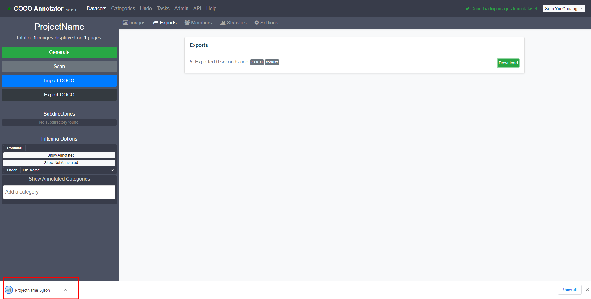

# Install
1. Install docker
2. Run `docker-compose up`

# Run
1. Go to `http://localhost:5000/` at any browser

# Create Dataset
0. Create a user and login
1. At Dataset page, click `create` button

2. Fill in the dataset name. In default categories, key in `forklift`, then click `Create Dataset`

# Import image
1. Find the `datasets` folder in the folder with the local repository
2. You will see the folder with the created project name is created

3. Copy the images into this folder to import the images

4. Back to the browser, double-click the project to enter the project interface

5. Click the `Scan` button to load images

6. Refresh the browser to reflect the changes

# Set up label
1. Double-click any image to go into annotation interface, click the setting button at forklift label

2. Click the add button to add new sublabel\

3. Create 12 points: 
   1. top_front_left
   2. top_front_right
   3. top_back_left
   4. top_back_right
   5. bot_front_left
   6. bot_front_right
   7. bot_back_left
   8. bot_back_right
   9. fork_front_left
   10. fork_front_right
   11. fork_back_left
   12. fork_back_right
4. Create connection accordingly
    1. top_front_left : 2, 3, 5
    2. top_front_right : 4, 6
    3. top_back_left : 7, 4
    4. top_back_right : 8
    5. bot_front_left : 6, 7
    6. bot_front_right : 8, 12
    7. bot_back_left : 8
    8. bot_back_right : 
    9. fork_front_left : 11
    10. fork_front_right : 12
    11. fork_back_left :
    12. fork_back_right :

# Start Labelling
1. Press `k` shortcut key to select keypoint

2. Annotate accordingly

# Export Labelling
1. Go back to project interface, click `Export COCO` button

2. Click `Export` button
1
3. Go to `Export` button and then click `Download` to download the label

4. Label file is downloaded into browser default download folder
